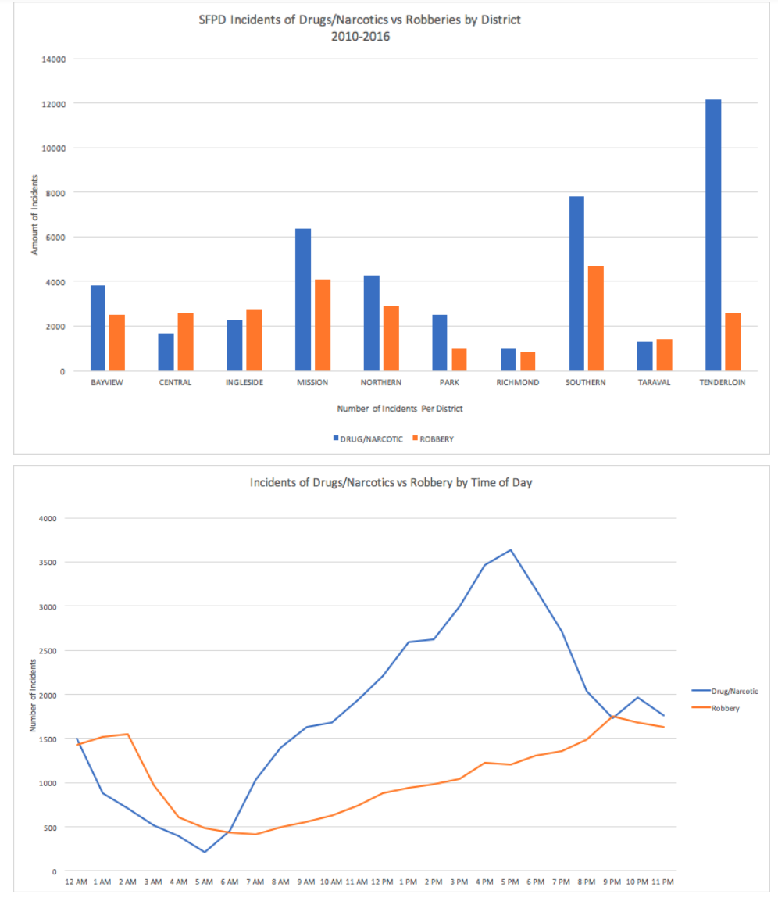
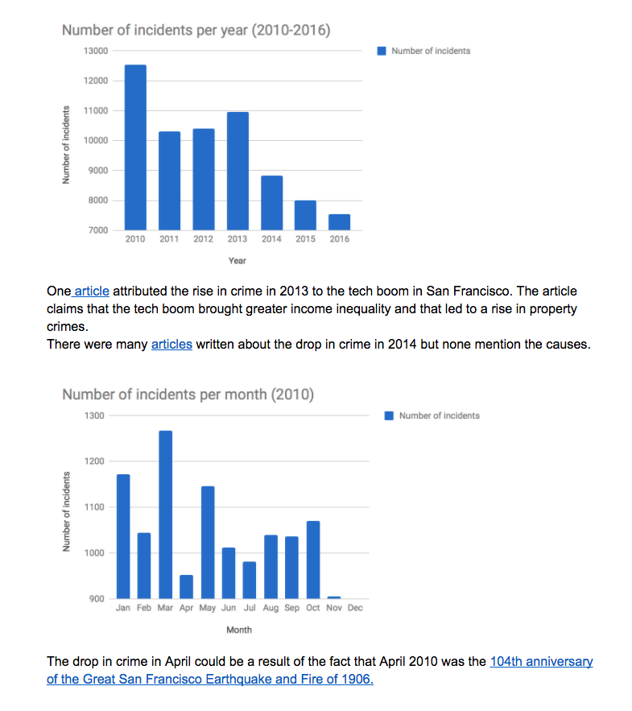

# can-viz sfpd-robbers-drugs-incidents

## 1. 

## 2.

## 3. 

## 4.

## 5.

## 6. 

## 7.

## 8.

## 9.

## 10.

## 11.

## 12. 

## 13.

> This GIF displays annual trends for robberies and drug/narcotics-related incidents as reported by the San Francisco Police Department incident log between the years of 2010 and 2016. As you can see, there is a general downward trend in drug/narcotic-related incidents over this six-year period, while trends for robberies remained mostly flat. The incidence drug/narcotic-related crimes showed a marked decrease during the 2014-15 and 2015-16 time frames.

## 14.

## 15. 

